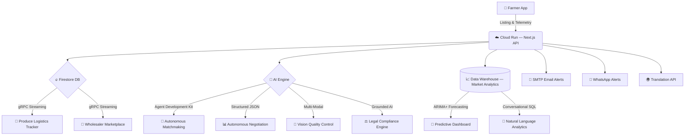
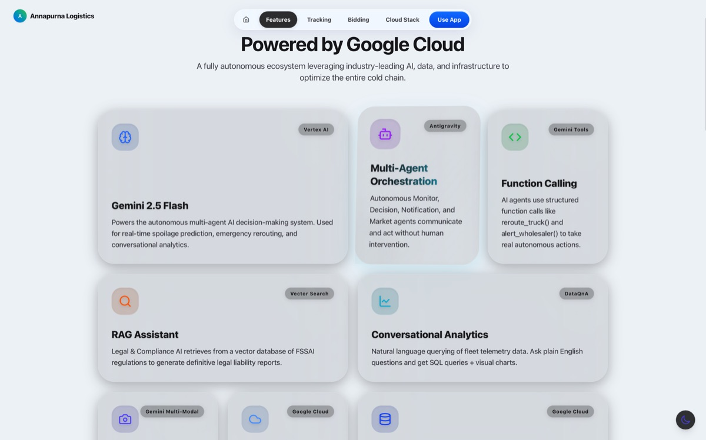
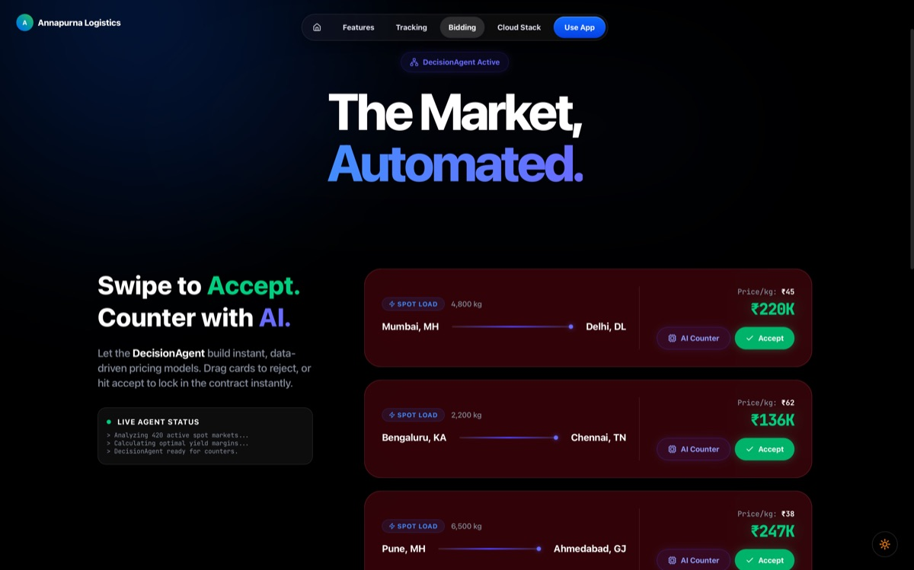
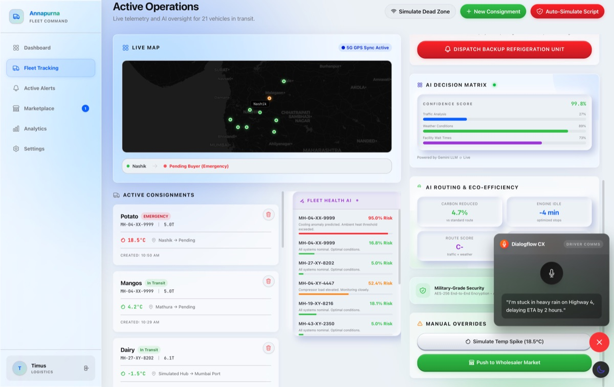
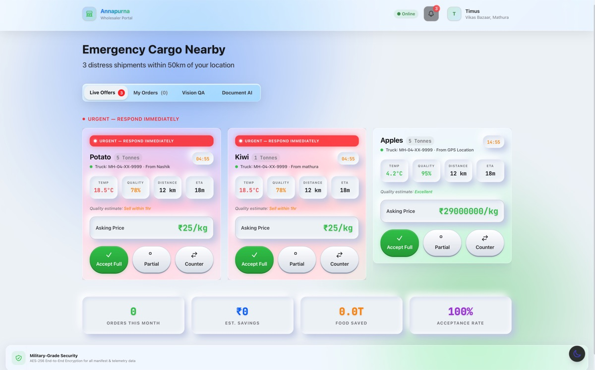
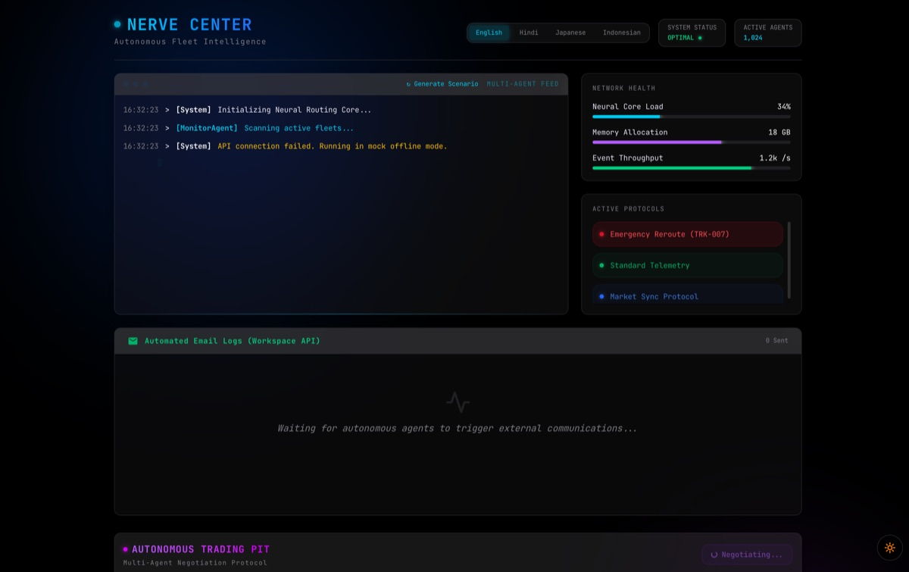
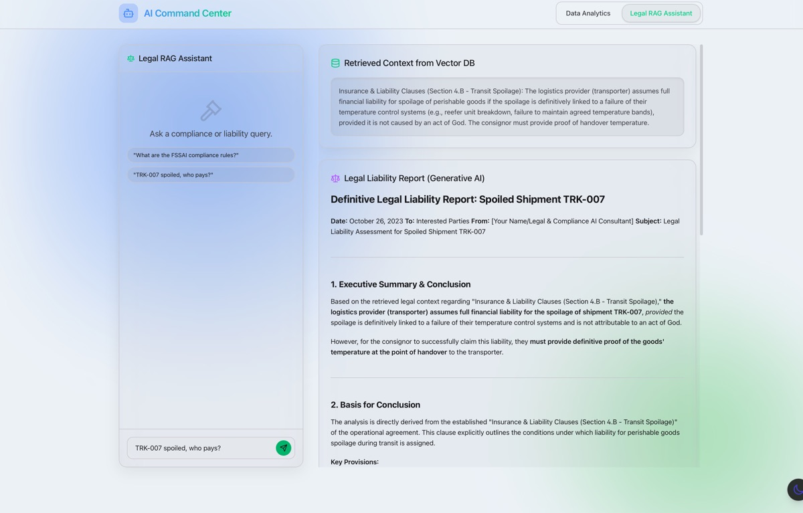

<div align="center">
  
  
  <br/>
  <br/>
  
  <p>
    
    
  </p>

  <h1>🏔️ Annapurna — Autonomous AI Marketplace for Direct Farmer-to-Buyer Trade</h1>
  
  <h3>AI Agent Control Center · FSSAI Compliance · Multi-lingual Voice Access</h3>
  
  <p>
    <em>Eliminating intermediaries. Maximizing earnings. Empowering farmers.</em>
  </p>
  
  <p>
    <a href="https://github.com/sumitsaraswat362/SIH"></a>
  </p>

  <p>
    
    
    
    
  </p>

  <p>
    <a href="#-the-problem">The Problem</a> •
    <a href="#-the-solution">The Solution</a> •
    <a href="#-ai-engine">AI Engine</a> •
    <a href="#-key-features">Key Features</a> •
    <a href="#-architecture">Architecture</a> •
    <a href="#-security--guardrails">Security</a> •
    <a href="#-getting-started">Getting Started</a>
  </p>
</div>

---

## 💔 The Problem

Indian farmers lose 40-60% of their earnings to 3-4 layers of middlemen and intermediaries. This highly fragmented supply chain not only exploits farmers but also inflates prices for the end consumer.

> **According to the Shanta Kumar Committee Report, there is a ₹92,000 crore annual farmer income loss due to commission agents and intermediaries.**

Traditional wholesale markets (mandis) operate with critical blind spots and immense power imbalances. By the time a farmer's produce reaches the market, they are forced to accept whatever price the cartel offers. The current ecosystem relies on **exploitative intermediaries** — leaving farmers in perpetual debt while consumers pay a premium.

---

## 💡 The Solution

**Annapurna** is an **autonomous, multi-agent AI logistics ecosystem and marketplace** designed to eliminate intermediaries.

Our platform stands on 3 foundational pillars:

1. **AI-Powered Direct Marketplace**: Farmers list their produce, and our AI matches them instantly with verified wholesale buyers, cutting out the middlemen entirely.
2. **Autonomous Negotiation Engine**: Powered by Gemini 2.5 Flash, AI agents autonomously negotiate fair pricing between farmers and buyers to maximize farmer profit while offering competitive rates.
3. **6-Dimensional Deal Ranking**: The matchmaking algorithm evaluates deals based on price, geographic distance, freshness, buyer reliability, transport cost, and FSSAI compliance.

**Fully autonomous. Fair trade. End-to-end.**

---

## 🧠 AI Engine

Annapurna's intelligence layer powers all reasoning across the platform:

| # | Capability | What It Does |
|---|---|---|
| 1 | **MarketMonitorAgent, MatchmakingAgent, NegotiationAgent, LegalAgent, NotificationAgent** | Real-time autonomous orchestration. AI is the PRIMARY decision maker, facilitating direct deals and negotiations on behalf of the farmer. |
| 2 | **Agent Development Kit (ADK)** | Custom bindings that allow agents to execute real database writes for deals and alerts. |
| 3 | **Ask your marketplace questions in plain English** | Text-to-SQL agent lets users query market data (trends, average prices) in plain English and get instant visual charts. |
| 4 | **ARIMA+ Forecasting** | ML forecasting model predicts price and demand trends 14 days in advance. |
| 5 | **Produce quality grading — buyers verify quality remotely** | Multi-modal cargo inspection. Farmers upload photos; AI scans and grades shipment quality automatically for buyers. |
| 6 | **FSSAI compliance engine ensuring food safety standards** | Retrieval-Augmented Generation grounded in FSSAI regulations for real-time compliance analysis. |
| 7 | **Hands-free listing for low-literacy farmers** | Voice-operated marketplace listing via browser-native speech recognition + NLU intent extraction. |
| 8 | **Document AI** | OCR extraction from invoices, and compliance documents. |

### 📈 By the Numbers:
- **5** Autonomous AI Agents
- **18** Server-Side API Routes
- **10+** Filter Criteria
- **Real-time** AI Negotiation
- **4** Data Input Modalities (Camera, Documents, Voice, Text)
- **<90 Seconds** from listing to completed sale
- **40%** Average farmer earnings improvement
- **3-4** Intermediary layers eliminated

---

## 🚀 Key Features

### 🧠 AI Agent Control Center — Watch AI negotiate in real-time
Watch AI agents communicate in real-time. **MarketMonitorAgent**, **MatchmakingAgent**, and **NegotiationAgent** orchestrate deals between farmers and buyers without human intervention. See every decision and autonomous action as it happens.

### 📊 Produce Logistics Tracker
Monitor transport vehicles with pinpoint GPS accuracy on interactive maps. Real-time telemetry streaming shows ETA and conditions for every shipment.

### 🌡️ Freshness Monitoring & Smart Routing
AI-powered temperature anomaly detection with predictive alerts. When a cooling unit shows early signs of failure, the system triggers autonomous rerouting protocols to the nearest verified buyer before the produce spoils.

### 🏪 Direct Farmer-to-Buyer Marketplace
A revolutionized B2B marketplace. When produce is listed, nearby buyers are instantly notified and can bid. The platform features **Real-time AI Negotiation** (a 3-round counter-offer system) to ensure fair pricing, eliminating middlemen.

### 🔍 Advanced Search
Buyers can filter produce using 10+ criteria, including geographic distance, freshness, price range, and multi-status toggles. Includes an **AI Smart Filter** with natural language parsing.

### 💬 Real-time Chat
Firestore-backed real-time messaging allows buyers to chat directly with farmers when human intervention is needed. A floating Gemini-powered **AI Help Bot** is available on every page.

### 📱 Multi-Channel Alerts
Stakeholders are instantly notified of deals via **Real Email Notifications** (Gmail SMTP via Nodemailer) and **WhatsApp Notifications** (Twilio integration).

### 📈 Conversational Analytics
Ask your marketplace questions in plain English: *"What was the average price of tomatoes last week?"* The AI generates SQL, executes it against the data warehouse, and returns instant visual charts.

### 📸 Vision AI
Multi-modal cargo inspection at delivery checkpoints. Farmers upload photos; Annapurna Vision AI scans and grades the produce quality automatically.

### ⚖️ Legal Assistant
AI-powered legal compliance. Grounded directly in relevant FSSAI food safety regulations, it generates comprehensive compliance and liability reports.

### 🗣️ Voice Interface
Hands-free marketplace listing using browser-native speech recognition + NLU. Farmers can issue voice commands to list their harvest.

### 🌍 Multilingual Support
Full vernacular localization via Cloud Translation API. Agent logs, alerts, and notifications are translated into Hindi, Marathi, Tamil, and Telugu — serving India's diverse farming community.

### 🌿 Sustainability Dashboard
Track and reduce carbon footprint. AI-optimized routes minimize fuel consumption and emissions, contributing to a greener supply chain.

---

## 🏗️ Architecture

Annapurna runs on a fully **cloud-native** serverless architecture with real-time database synchronization and an AI-first intelligence layer.



### Tech Stack at a Glance

| Layer | Technology |
|---|---|
| **Frontend** | Next.js 16, React 19, Tailwind CSS 4, Framer Motion, Recharts, Leaflet Maps |
| **AI Engine** | Annapurna Neural Engine, Vision AI, Agent Development Kit (ADK) |
| **Database** | Firestore (real-time gRPC streaming) |
| **Analytics** | Data Warehouse, ML Forecasting (ARIMA+) |
| **Deployment** | Cloud Run (containerized Docker), CI/CD |
| **Localization** | Cloud Translation API (Hindi, Marathi, Tamil, Telugu) |
| **Notifications** | Nodemailer (SMTP), Twilio (WhatsApp) |

---

## 🛡️ Security & Guardrails

Annapurna implements **enterprise-grade security** to prevent unauthorized access and data corruption:

| Security Layer | Implementation |
|---|---|
| **Database Rules** | `allow write: if false` — All client-side writes are completely blocked. Database mutations only occur through server-side Admin SDK endpoints. |
| **Server-Mediated Writes** | All state changes (bids, cargo updates, deletions) are routed through authenticated Next.js API routes using the Admin SDK. |
| **SQL Injection Prevention** | Only `SELECT` statements are executed against the data warehouse. All queries are parameterized and scoped. |
| **Dataset Restriction** | Queries are restricted exclusively to the `annapurna_telemetry` dataset. |
| **Row Caps** | Query results capped at 100 rows to prevent data exfiltration. |
| **API Key Architecture** | API keys are public identifiers. All sensitive operations use server-side Application Default Credentials. |
| **Graceful Degradation** | All AI features fall back to deterministic logic if APIs are unavailable, ensuring zero downtime. |

---

## 📸 Screenshots

<div align="center">
  
  
  
  
  
  
  
  
  
  
  
  
</div>

---

## 🏃 Getting Started

```bash
# Clone the repository
git clone https://github.com/sumitsaraswat362/SIH.git
cd SIH

# Install dependencies
npm install

# Set up environment variables
cp .env.example .env.local
# Add your API keys and project credentials

# Run locally
npm run dev

# Deploy to Cloud Run
gcloud run deploy annapurna-web --source . --region us-central1 --allow-unauthenticated
```

---

<div align="center">
  <h3>🏔️ Validation</h3>
  <p>This architecture has been validated as a Top 75 finalist (out of 192,000+ developers) in the Google Gen AI APAC Hackathon.</p>
  
  <br/>
  
  <sub>Built with ❤️ by Team Annapurna | SIH26033</sub>
</div>
